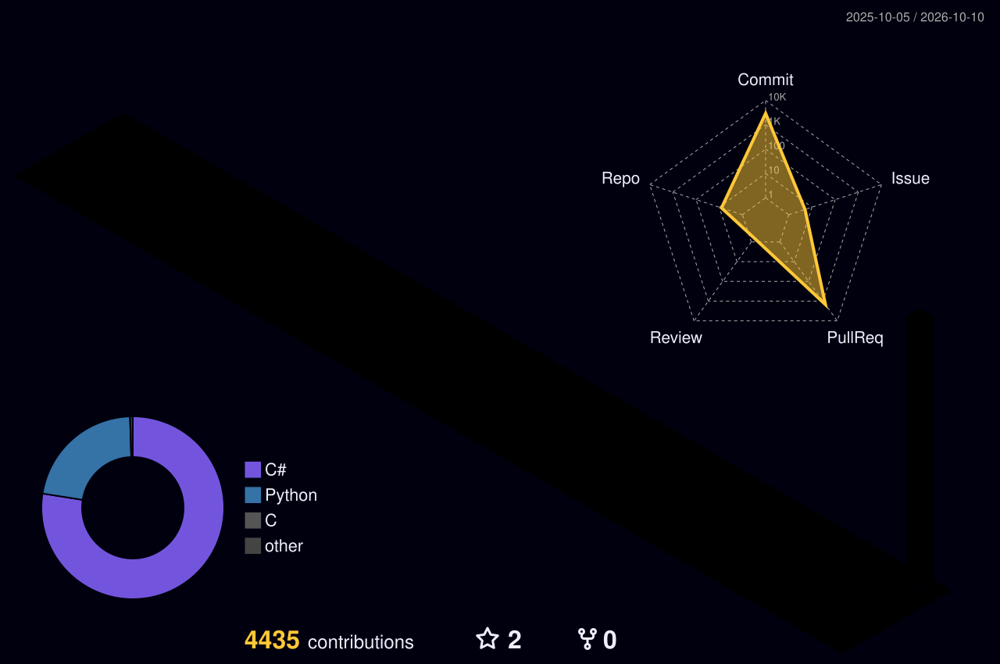

  

  <b>Reverse Engineer & Cybersecurity Researcher</b> focused on malware analysis, binary exploitation, and offensive security. 
  Building tools, solving CTFs, and sharing knowledge.

  <a href="https://hellstorm.blog">🌐 Blog</a> •
  <a href="mailto:mr.glint@agentmail.to">📧 Email</a> •
  <a href="https://discord.gg/discord.com/invite/1528872361359573113">💬 Discord</a>

---

### 💫 About Me

- 🔍 **OSINT** — Reconnaissance, Threat Intelligence
- 🧬 **Digital Forensics** — Memory Analysis, Disk Forensics
- 🦠 **Malware Development** — C2, Evasion, Persistence
- 🕸️ **Web Security** — SQLi, XSS, SSTI, SSRF
- 💥 **Binary Exploitation** — Buffer Overflows, ROP Chains
- ⚙️ **Reverse Engineering** — PE Files, Malware Unpacking

---

### 📊 3D Contributions

  

---

### 💻 Tech Stack

  
  
  
  
  
  

  
  
  
  
  
  
  

---

### 📊 GitHub Stats

  
   
  
   
  

### 🏆 GitHub Trophies

  

---

  

